# Build-a-Blog

Visit the blog [here](https://iurjoh-devblog.herokuapp.com/)

This is a blog made to demonstrate my basic knowledge acquired in the Code Institute's Full Stack developer course. In this project a fully functional blog was created using Django and its libraries, Bootsrap and other tools.

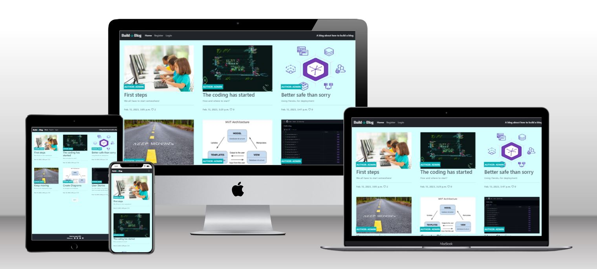

## Table of Contents

- [Languages Used](#languages-used)
- [Project Prerequisites](#project-prerequisites)
- [Development Stages](#development-stages)
- [Installed Libraries, APIs, and Other Services](#installed-libraries-apis-and-other-services)
- [Auxiliary Tools](#auxiliary-tools)
- [Existing Features](#existing-features)
  - [Authentication and Authorization](#authentication-and-authorization)
  - [Sign Up, Sign In, and Sign Out](#sign-up-sign-in-and-sign-out)
  - [Header & Menu](#header--menu)
  - [Toggler Button](#toggler-button)
  - [Warning Messages](#warning-messages)
  - [Post Area](#post-area)
  - [Share Buttons](#share-buttons)
  - [Footer](#footer)
  - [Admin Site](#admin-site)
  - [Post Detail](#post-detail)
  - [Likes and Likes Counter](#likes-and-likes-counter)
  - [Comments, Comments Counter, and Comments Box](#comments-comments-counter-and-comments-box)
  - [Create Post Form](#create-post-form)
  - [Edit Post Form](#edit-post-form)
  - [Delete Post](#delete-post)
  - [Contact Me Form](#contact-me-form)
- [Features to Increment](#features-to-increment)
- [Bugs](#bugs)
- [Tests](#tests)

# What exactly is Build-a-Blog?

It is a blog that has in its posts the step by step of how I felt when I was developing this project. So in a way it is a diary of how I felt about the project at each step. Thus, other young developers can sign up, and then have access to the posts, being able to read, interact with the content through likes, comments and even share the posts with whoever they want.

# Languages Used

- [Python](https://en.wikipedia.org/wiki/Python_(programming_language))
- [HTML5](https://en.wikipedia.org/wiki/HTML)
- [CSS3](https://en.wikipedia.org/wiki/CSS)

# Project Prerequisites

In this blog a base template from the Code Institute was used, adding to it code written in HTML, CSS, Python, use of Cloudinary, Django, Allauth, Bootstrap, Crispy forms, Social share and Summernote, Gunicorn, Pscopg2, ElephantSQL, Heroku.

# Development Stages

- Create a Django Project Checklist
- Create an Empty Django Project
- Create a Heroku App
- Create a Database
- Create an env.py File
- Modifying settings.py
- Setting Heroku Config Vars
- First Deployment
- Create a Database Diagram
- Create a Database Models
- Create an Admin Site
- Create Basic Views
- Create Basic Templates
- Conneting URLs
- Create a Post Detail View
- Implement of Authentication and Authorization
- Create a Comment Function
- Create a Like Function
- Create a Post Share Function
- Create Warning Messages
- Create a Creat Post Front End Function
- Create an Edit Post Front End Function
- Create a Delete Post Front End Function
- Create a Contact Me Front End Function
- Test Blog
- Fixing Bugs
- Final Deployment

## Installed libraries, APIs and other services

- Cloudinary
- Django Allauth
- Django Bootstrap Icons
- Django Crispy Forms
- Django Social Share
- Django Summernote
- Gunicorn
- Oauthlib
- Psycopg2

## Auxiliary Tools
- Entity Relationship Diagram

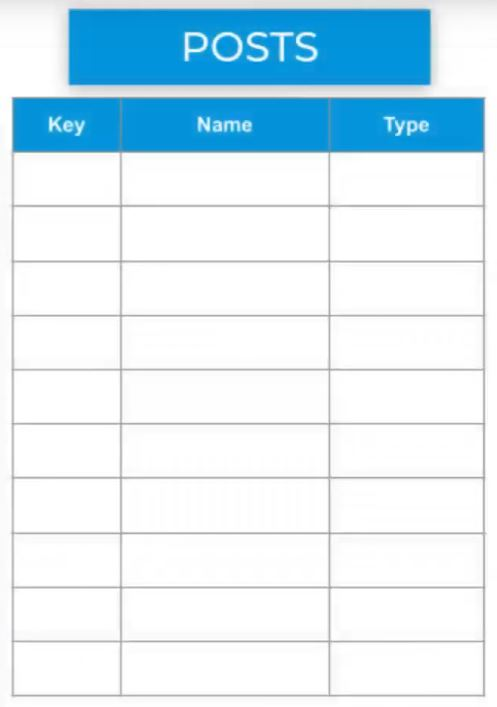 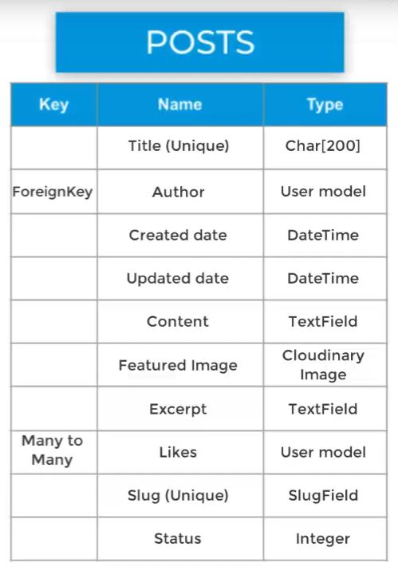

- MVT diagram (MODEL - VIEW - TEMPLATES)

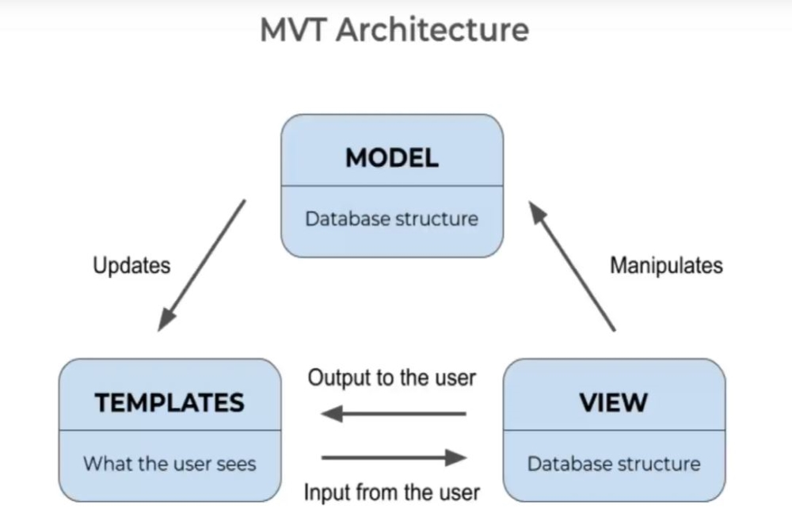

- User Stories

 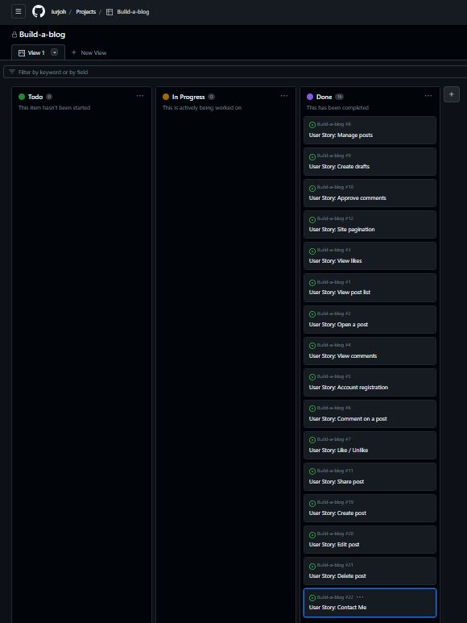

# Existing Features
## Authentication and Authorization

These two processes are important and bring security to the blog. To implement these functions, Allauth was used, which as described on its website as "Integrated set of Django applications addressing authentication, registration, account management as well as 3rd party (social) account authentication."

## Sign Up, Sign In and Sign Out

Therefore, Allauth allows the blog to require users to register using a basic form, and after that they can sign in and start interacting with the site in a secure way. It also allows the administrator (logged in as such) to keep all blog functions secure, such as deleting offensive comments. So to use the blog it is necessary to sign up, to sign in, and once logged in it is possible to sign out.

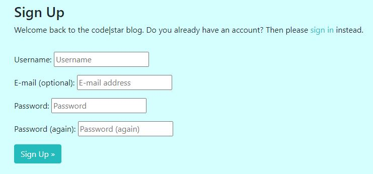

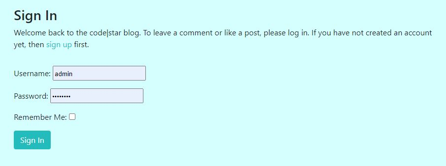

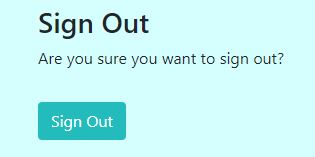

## Header & Menu

The header presents the name of the blog in a stylized way, two tabs for easy access to home and Login/Logout and a brief description of what the blog is about in the right corner.

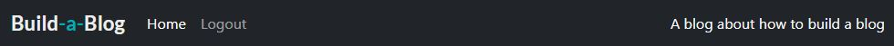

## Toggler Button

When using the blog on devices with small screens, the site displays the toggler button on the upper right. Then the tabs home, Login/logout and the description of the blog are inserted inside it.

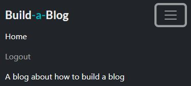

## Warning Messages

Warning messages are displayed when the blog user signs up, sign in, sign out and when he leaves a comment on any of the posts.

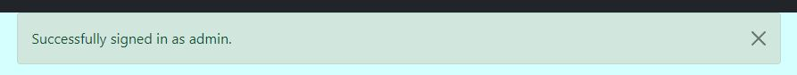

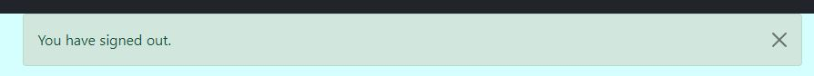

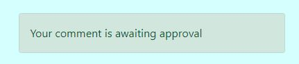

## Post Area

All posts already published are grouped on the screen, which at its maximum capacity will display 6 posts on a larger screen and in its smaller screen version will display each post on top of the other.

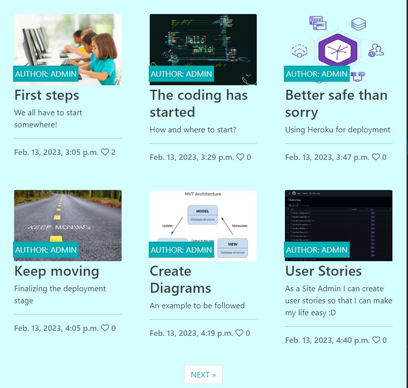

## Share buttons

To add interactivity to the user, a bar with four buttons is available in the post for sharing through messaging applications.

The user can choose to share the post being read through Twitter, WhatsApp, Telegram or Reddit.

Each button has the icon and colors of the respective messenger for easy identification and simple use.

After clicking on the chosen messenger, the user is taken to a page of the given company where he will login to continue. Then you will be given the opportunity to share the site where the post is contained and then the submission can be carried out.

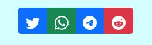

## Fotter

In this section we find the details of the blog developer and links to their social networks.

## Admin Site

Here we can find everything that is available to the Admin, from the maintenance of emails, groups, users, comments, posts, attachments and registered sites, social accounts and other CRUD features (Create, Read, Update and Delete).

All this is created through a base already delivered by Django and through the addition of other functionalities and libraries, new options are being added to the interface. For example, when we program the possibility of creating new posts, or we add a new form of authentication through other social networks, new areas are created within this panel.

For better maintenance of all the functions of the admin site and to make everything even easier and more practical, there are also filters that can be used for searches through approved or not approved posts or comments, in addition to options by time, author, etc.

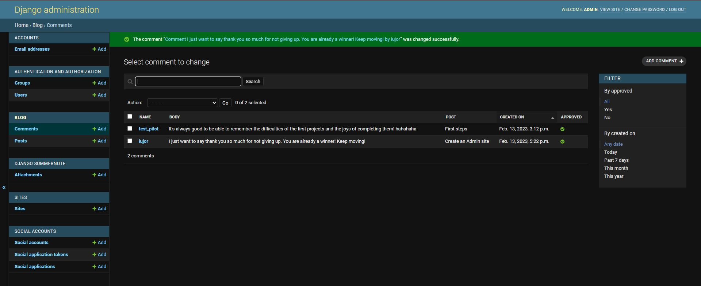

## Post Detail

When clicking on one of the posts, the user is redirected to a page where the selected post is displayed in full, with its title, author, date and time of posting.

The content of the post can then be read in its entirety.

The amount of likes and comments made and accepted by the admin are also visible.

A bar with options for sharing the post is available so that the user can then directly send the link to someone who wants to.

A text box is displayed at the bottom right of the screen so that the user can interact with the author by leaving his comment.

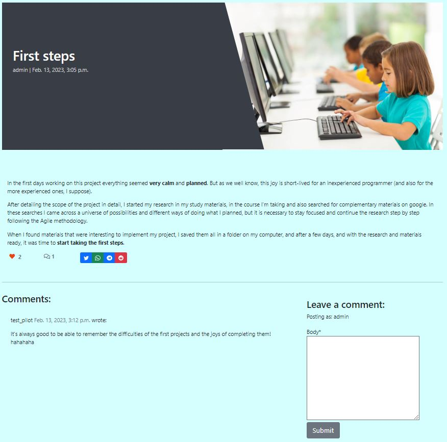

## Likes and Likes Counter

A like button is available to the user logged in and viewing a specific post. By clicking on the heart icon, the user interacts with the author leaving the icon filled in red, and if he wants to undo the action, just click again and the icon will return to its initial empty state.

A likes counter is visible for everyone to see the number of times users interacted positively with the content

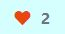

## Comments, Comments Counter and Comments Box

A comment counter is visible for everyone to see the number of times users have interacted by leaving a personal comment for the author of the post.

The comment must be written using the comments box at the bottom right of the post.

After writing the comment, the user must click on the submit button and then it will be up to the admin to analyze and approve the comment so that it can be seen in the comments area visible to all users.

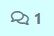

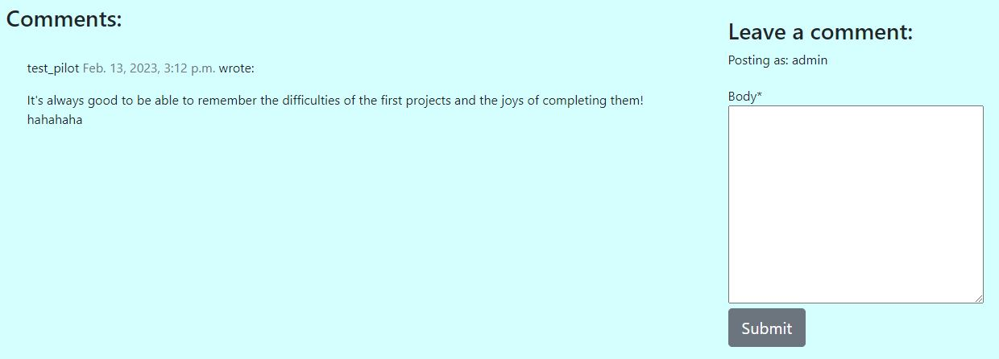

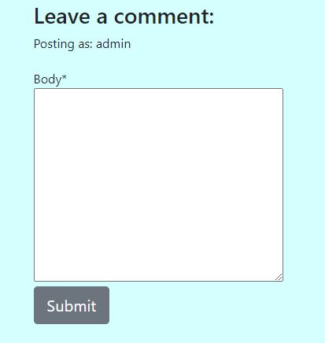

## Create Post Form

When the user is logged in and wants to create a new post, it will be possible to click on "Create post" displayed on the menu bar and he will be redirected to a form.

In this form, the user can insert information in fields such as: title, image - where he can use the image default or choose to upload a new one, excerpt and content.

By default, for frontend users, the post status will not be optional, so it will always be "published". By confirming the "Create post" button, this post will be published and the user will be redirected to your new published post page.

## Edit Post Form

When the user is logged in and wants to edit a post of his own, it will be possible to click on the blue button (Pen and Papper icon), displayed in the icon bar just below the text in the body of the post, to edit it. It will then be redirected to a form.

In this form, the user can enter information in fields such as: title, image - where he can use the image already present or choose to upload a new one to replace it, excerpt and content.

By confirming the "Update" button, this post will be edited/republished. Then the user will be redirected to your post page with all the changes made and saved.

## Delete Post

When the user is logged in and wants to delete a post of his/her authorship, it will be possible to click on the red button (trash can), displayed in the icon bar just below the text in the body of the post, to delete this post permanently. 

Then, he will receive a confirmation message "Are you sure you want to delete this post?", if he clicks OK, he will be confirming and deleting his post.

Upon confirming by clicking the "OK" button, this post will be permanently deleted. Then, the user will be redirected to the home page where all posts will be displayed, except for the excluded ones.

## Contact Me Form

If the user is logged in, when entering one of the posts, will have a detailed view of all the information contained therein. If the user wants to contact the creator of the post, he can comment publicly and wait for his comment to be accepted by the admin.

However, to talk about something directly with the creator of the post directly and privately, the user has a "Contact Me" button positioned just below the comments section.

By clicking on this button, you will be redirected to a form with email, subject and message fields. Once completed, the user will click on the "Send Message" button.

Then, the user will be redirected to the home page where all posts will be displayed.

# Features to Increment

- Option to login through social networks and other services, like GMail, Outlook, Github, etc.
- More options for interaction with the content for the user, such as being able to interact with gifs, emoticons and images through the comment box.
- Added an area for the Author's profile, with a brief description and photo.

# Bugs

During the development of this project some bugs were found. The vast majority of bugs have usually been caused by mispelling or misuse of Django library and add-on features, such as the use of Bootstrap.

All errors were duly corrected throughout development with the help of proper documentation regarding each item. Tools such as the Code Institute Slack channel, help from tutors of this same course, sites such as Stack Overflow and other internet forums were also used.

In the final stage of development only one bug persisted. The issue seems to be related to the Bootstrap JavaScript library conflicting with the logout functionality. It's possible that the data-bs-toggle and data-bs-dismiss attributes are causing unintended behavior when clicked. So by choice of this developer, the term that caused this bug was removed from the code and so no other problem related to this malfunction was found.

# Tests

Tests were done along each step of the implementation of new features. In general, they were always easily run because they were just long lines or lack/excess space in the lines of code.

Most of these errors happened during the implementation of new urls, again mostly due to typos quickly corrected before starting to implement other new functionality.

Only a few lines of JavaScript are present in this blog project and to test them JSFiddle was used and no errors or bugs were found.

Python syntax checker from Extends Class and Python style guide checker from pycodestyle 2.9.1 were used to test, verify and validate code written in python.

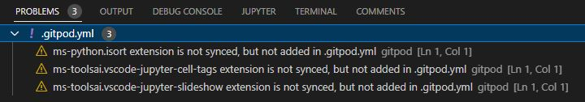

Flake8 used and do not show any serious problems found other than "unused" or "line too long".

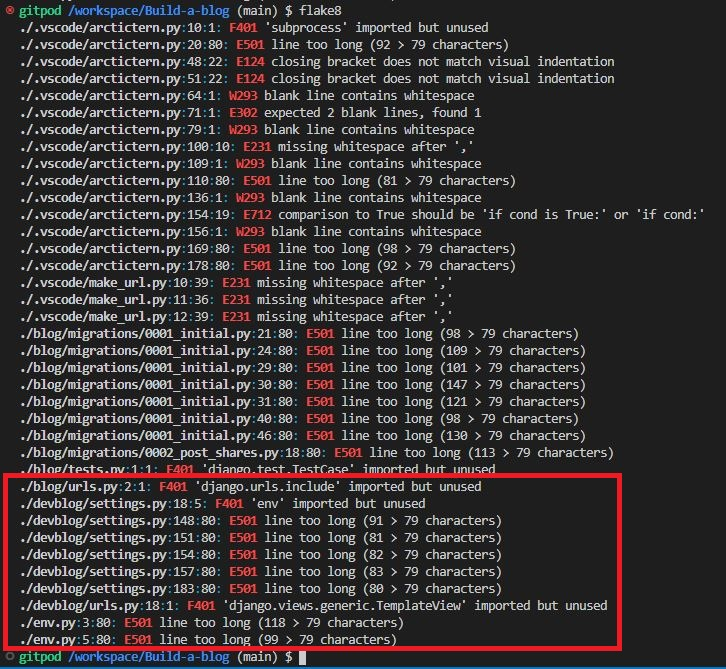

CI Python Linter from Code Institute was used to test if my python code complies with PEP8 and succeeded.

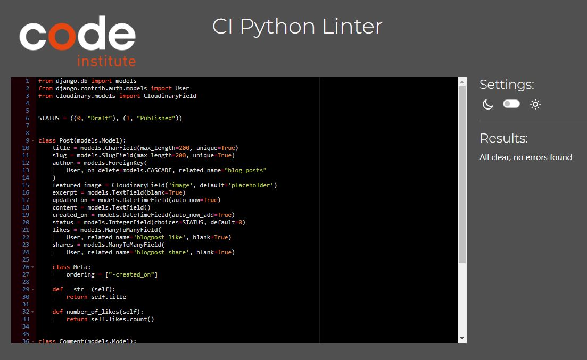

Test using my own mobile showed two bugs that don't always show up. In some situations, after zooming out and zooming in on the mobile screen, the like and comment icons are very close or overlapping. The second bug also happens in the same circumstance, but the sharing buttons disappear from the screen.

The same cannot be seen when using a computer and my browser's inspect mode to simulate the same circumstances. Even zooming in and out nothing changed the distribution of the buttons or made the share buttons disappear.

Another bug that could be seen was that when using small screens the post image is shown on the cover but not on the post itself after opening. However, this should not be considered a bug, just a limitation for this screen size and possibly adjusted by creating a specific mediaquery for smaller screens.

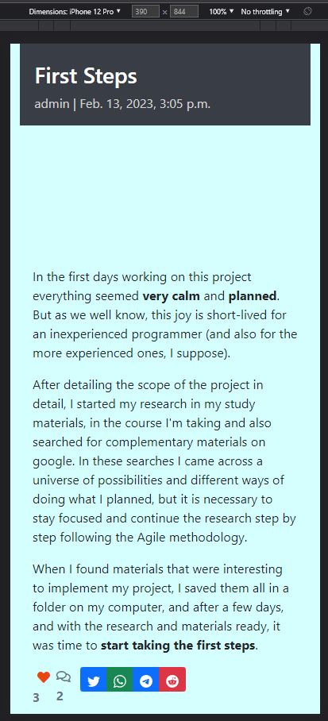

# Deployment

This blog was deployed using Code Institute's mock terminal for Heroku.
- First fork or clone this repository
- Create a new Heroku app
- Link the Heroku app to the GitHub repository
- Click on deploy 

The link to the deployed blog at Heroku is: https://iurjoh-devblog.herokuapp.com/

The full file was also deployed in my GitHub repository. The steps are as follows:
- In the GitHub repository, click on Settings tab;
- Navigate to the menu on the left side and select Pages;
- Set the source in the Build and deployment item as "Deploy from a branch". Then, in the Branch item, the Main option was chosen, /(root) folder and finishing the settings with the Save button.

The link to the deployed website at GitHub is: https://github.com/iurjoh/Build-a-blog/

# Credits

Here will be the sites that helped me find everything I needed to develop my work, including research and material sources.

## Content

Sites such as:
- [Stack Overflow](https://stackoverflow.co/) were used at various times to clear up recurring doubts;
- [Code Institute](https://learn.codeinstitute.net/) to review material of study explanatory videos and guides on how to set up a complete website;
- [GitHub](https://github.com/) to better understand other projects;
- [Google](https://www.google.com) for more information on subjects related to the that I had to study during the creation of the site;
- [Youtube](https://www.youtube.com/) tutorials to learn using in a practical way some of the methods necessary to implement the desired functions for the blog;
- [Pycodestyle](https://pypi.org/project/pycodestyle/) used to validade my python code;
- [Flake8](https://flake8.pycqa.org/en/latest/) used to test my pyhton code at local terminal;
- [CI Python Linter](https://pep8ci.herokuapp.com/#) used to test if my pyhton code it complies with PEP8;
- [Extends Class](https://extendsclass.com/python-tester.html) used to test my python code syntax;
- [JSFiddle](https://jsfiddle.net/) used to test my few lines of JavaScript in this project;
- [Slack](https://slack.com/) communities to ask questions and access answers to questions that I found in the development of the site;
- [Django Documentation](https://docs.djangoproject.com/en/4.1/) to access all the documentation implemented in this project including models, views, etc;
- [Django Social Share](https://pypi.org/project/django-social-share/) to access all the documentation to implement share buttons function;
- [Django Allauth](https://django-allauth.readthedocs.io/en/latest/) to access all the documentation to implement authentication and authorization functions;
- [Django Bootstrap Icons](https://pypi.org/project/django-bootstrap-icons/) to access all the documentation to implement the use of the icons that are inside the share buttons;
- [Font Awesome](https://fontawesome.com/icons) to get icons for this project;
- [Color Hunt](https://colorhunt.co/palettes/) for inspiration about color palettes;
- [Bootstrap Icons](https://icons.getbootstrap.com/) to get icons for this project;
- [Bootstrap Documentation](https://getbootstrap.com/docs/4.0/getting-started/introduction/) to access all the documentation to use many of Bootstrap shortcuts.

## Media

- [Techsini](https://techsini.com/multi-mockup/index.php) Multi Device Website Mockup Generator was used to generate the image used in this README.md in the opening section.

## Acknowledgements
- My mentor for continuous helpful feedback.