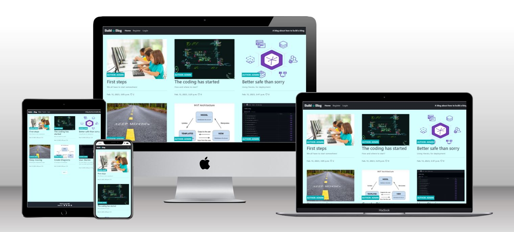

# Build-a-Blog

Visit the blog [here](https://iurjoh-devblog.herokuapp.com/)

This is a blog made to demonstrate my basic knowledge acquired in the Code Institute's Full Stack developer course. In this project a fully functional blog was created using Django and its libraries, Bootsrap and other tools.

# What exactly is Build-a-Blog?

It is a blog that has in its posts the step by step of how I felt when I was developing this project. So in a way it is a diary of how I felt about the project at each step. Thus, other young developers can sign up, and then have access to the posts, being able to read, interact with the content through likes, comments and even share the posts with whoever they want.

# Project Prerequisites

In this blog a base template from the Code Institute was used, adding to it code written in HTML, CSS, Python, use of Cloudinary, Django, Allauth, Bootstrap, Crispy forms, Social share and Summernote, Gunicorn, Pscopg2, ElephantSQL, Heroku.

# Development Stages

- Create a Django Project Checklist
- Create an Empty Django Project
- Create a Heroku App
- Create a Database
- Create an env.py File
- Modifying settings.py
- Setting Heroku Config Vars
- First Deployment
- Create a Database Diagram
- Create a Database Models
- Create an Admin Site
- Create Basic Views
- Create Basic Templates
- Conneting URLs
- Create a Post Detail View
- Implement of Authentication and Authorization
- Create a Comment Function
- Create a Like Function
- Create a Post Share Function
- Create Warning Messages
- Test Blog
- Fixing Bugs
- Final Deployment

# Features
## Existing Features
### Authentication and Authorization

These two processes are important and bring security to the blog. To implement these functions, Allauth was used, which as described on its website as "Integrated set of Django applications addressing authentication, registration, account management as well as 3rd party (social) account authentication."

### Sign Up, Login and Logout

Therefore, Allauth allows the blog to require users to register using a basic form, and after that they can sign in and start interacting with the site in a secure way. It also allows the administrator (logged in as such) to keep all blog functions secure, such as deleting offensive comments. So to use the blog it is necessary to sign up, to sign in, and once logged in it is possible to sign out.

### Header & Menu

The header presents the name of the blog in a stylized way, two tabs for easy access to home and Login/Logout and a brief description of what the blog is about in the right corner.

### Toggler Button

When using the blog on devices with small screens, the site displays the toggler button on the upper right. Then the tabs home, Login/logout and the description of the blog are inserted inside it.

### Warning Messages

Warning messages are displayed when the blog user signs up, sign in, sign out and when he leaves a comment on any of the posts.

### Post Area

All posts already published are grouped on the screen, which at its maximum capacity will display 6 posts on a larger screen and in its smaller screen version will display each post on top of the other.

### Fotter

In this section we find the details of the blog developer and links to their social networks.

### Admin Site

Here we can find everything that is available to the Admin, from the maintenance of emails, groups, users, comments, posts, attachments and registered sites, social accounts and other CRUD features (Create, Read, Update and Delete).

All this is created through a base already delivered by Django and through the addition of other functionalities and libraries, new options are being added to the interface. For example, when we program the possibility of creating new posts, or we add a new form of authentication through other social networks, new areas are created within this panel.

For better maintenance of all the functions of the admin site and to make everything even easier and more practical, there are also filters that can be used for searches through approved or not approved posts or comments, in addition to options by time, author, etc.

### Post Detail

When clicking on one of the posts, the user is redirected to a page where the selected post is displayed in full, with its title, author, date and time of posting.

The content of the post can then be read in its entirety.

The amount of likes and comments made and accepted by the admin are also visible.

A bar with options for sharing the post is available so that the user can then directly send the link to someone who wants to.

A text box is displayed at the bottom right of the screen so that the user can interact with the author by leaving his comment.

### Likes and Likes Counter

A like button is available to the user logged in and viewing a specific post. By clicking on the heart icon, the user interacts with the author leaving the icon filled in red, and if he wants to undo the action, just click again and the icon will return to its initial empty state.

A likes counter is visible for everyone to see the number of times users interacted positively with the content

### Comments, Comments Counter and Comments Box

A comment counter is visible for everyone to see the number of times users have interacted by leaving a personal comment for the author of the post.

The comment must be written using the comments box at the bottom right of the post.

After writing the comment, the user must click on the submit button and then it will be up to the admin to analyze and approve the comment so that it can be seen in the comments area visible to all users.

## Features to Increment
- Option to login through social networks and other services, like GMail, Outlook, Github, etc.
- More options for interaction with the content for the user, such as being able to interact with gifs, emoticons and images through the comment box.
- Added an area for the Author's profile, with a brief description and photo.

# Tests

Python syntax checker from Extends Class and Python style guide checker from pycodestyle 2.9.1 were used to test, verify and validate code written in python.

No errors were returned from both.

# Languages Used
- [Python](https://en.wikipedia.org/wiki/Python_(programming_language))

# Deployment
This blog was deployed using Code Institute's mock terminal for Heroku.
- First fork or clone this repository
- Create a new Heroku app
- Set the buildbacks to Python and NodeJS in that order
- Link the Heroku app to the GitHub repository
- Click on deploy 

The link to the deployed blog at Heroku is: https://git.heroku.com/iurjoh-treasure-hunt.git/###############################################################

The full file was also deployed in my GitHub repository. The steps are as follows:
- In the GitHub repository, click on Settings tab;
- Navigate to the menu on the left side and select Pages;
- Set the source in the Build and deployment item as "Deploy from a branch". Then, in the Branch item, the Main option was chosen, /(root) folder and finishing the settings with the Save button.

The link to the deployed website at GitHub is: https://iurjoh.github.io/Treasure-Hunt/###############################################################

# Credits
Here will be the sites that helped me find everything I needed to develop my work, including research and material sources.

## Content

Sites such as:
- [Stack Overflow](https://stackoverflow.co/) were used at various times to clear up recurring doubts,
- [Code Institute](https://learn.codeinstitute.net/) to review material of study explanatory videos and guides on how to set up a complete website;
- [GitHub](https://github.com/) to better understand other projects;
- [Google](https://www.google.com) for more information on subjects related to the that I had to study during the creation of the site;
- [Youtube](https://www.youtube.com/) tutorials to learn using in a practical way some of the methods necessary to implement the desired functions for the blog;
- [Pycodestyle](https://pypi.org/project/pycodestyle/) used to validade my python code;
- [Extends Class](https://extendsclass.com/python-tester.html) used to test my python code syntax;
- [Slack](https://slack.com/) communities to ask questions and access answers to questions that I found in the development of the site;
- [Django Social Share](https://pypi.org/project/django-social-share/) to access all the documentation to implement the share button function;
- [Django Bootstrap Icons](https://pypi.org/project/django-bootstrap-icons/) to access all the documentation to implement the use of the icons that are inside the share buttons;
- [Font Awesome](https://fontawesome.com/icons) to get icons for this project;
- [Bootstrap Icons](https://icons.getbootstrap.com/) to get icons for this project;
- [Bootstrap Documentation](https://getbootstrap.com/docs/4.0/getting-started/introduction/) to access all the documentation to use many of Bootstrap shortcuts;

## Media

- [Techsini](https://techsini.com/multi-mockup/index.php) Multi Device Website Mockup Generator was used to generate the image used in this README.md in the opening section.

## Acknowledgements
- My mentor for continuous helpful feedback.

## 1st Commit

Create a Django project

Install gunicorn, dj_database_url, psycopg2 and cloudinary to create the necessary libraries within the project.
pip3 install 'django<4' gunicorn
pip3 install dj_database_url==0.5.0 psycopg2

Create requirements.txt to update the list.

Create an app called blog to actually start the project.

Perform migration to update the project.

Test the created app using the runserver command.

## 2nd commit

Create a new app on Heroku.

Create a new database using ElephantSQL.

Updating env.py and settings.py files preparing prjote for deployment.

## 3rd commit
Setup cloudinary.

Create 3 new folders in main branch: meida, static and templates.

Create a Procfile and deploy app with Heroku.

Test if deployment is successful.

## Create a Database Diagram
In this project, the diagram with MVT architecture is used, that is, MODEL - VIEW - TEMPLATES, described in the image below %%%%%%%%%%%%%%%%%%%%%%%%%.

## Create a Entity Relationship Diagram
To maintain organization and standard, during the process of creating the database I use the Entity Relationship Diagram, as seen in the images.

## Create Models
Using the diagrams above allows the creation of two initial modes, Post and Comment. Then, as you should do after every change in models, you must use the commands "python3 manage.py makemigrations" and "python3 manage.py migrate" to migrate all changes to the database

## Create a Admin site
"python3 manage.py createsuperuser" to create a new admin panel

## Install summernote
"pip3 install django-summernote" and use "pip3 freeze --local requirements.txt" to update requirements.txt.

## Install allauth
"pip3 install django-allauth" to be able of use a strong authorization and provide more options to the user.

## install Crispy forms
pip3 install django-crispy-forms to use this library and help with formatting of comments.

## Install Django Social Share
pip3 install django-social-share to use this library and provide a share method to the user.

## ERRORS
#Solved
Updating env.py and settings.py to match new secret keys to be able to migrate database to Elephant SQL
SECRET_KEY = os.environ.get('SECRET_KEY', 'the_@nswer_is_42!')