# Build-a-Blog

**Português (Brasil)** | [English](README.md)

Blog de estudo feito durante o curso Full Stack da Code Institute. As publicações foram pensadas como um diário do desenvolvimento: o que o autor aprendeu e sentiu em cada etapa, com interação por comentários, curtidas e compartilhamento.

**Revisão de documentação:** 01/10/2026. Planejamento, screenshots e testes descritos abaixo vêm do registro original. Nenhum teste foi executado novamente nesta atualização.

> **Segurança antes de republicar:** as views atuais de edição e exclusão em `blog/views.py` não verificam login ou autoria no servidor, e as rotas as chamam diretamente. Botões escondidos no frontend não substituem autorização. Corrija e teste esses controles antes de disponibilizar o aplicativo com dados reais. Esta atualização altera apenas documentação.

**Deploy histórico:** https://iurjoh-devblog.herokuapp.com/ respondeu HTTP 404 com a página Heroku "No such app" em 01/10/2026. Nenhum deploy ativo nesse endereço foi confirmado. O link GitHub do projeto é o repositório de código, não um site Django funcionando.

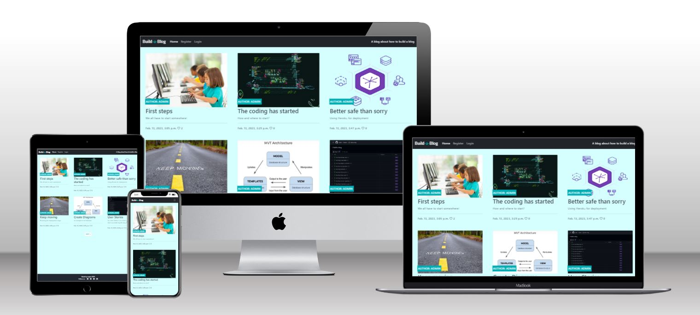

## Sumário

- [Objetivo e planejamento](#objetivo-e-planejamento)
- [Arquitetura e ferramentas](#arquitetura-e-ferramentas)
- [Design e funcionalidades](#design-e-funcionalidades)
- [Próximas funcionalidades](#próximas-funcionalidades)
- [Bugs e testes históricos](#bugs-e-testes-históricos)
- [Desenvolvimento local e deploy](#desenvolvimento-local-e-deploy)
- [Créditos e licença](#créditos-e-licença)

## Objetivo e planejamento

O projeto demonstra conhecimentos básicos de Django, suas bibliotecas e Bootstrap. O planejamento original partiu de um template da Code Institute e registrou as etapas abaixo:

1. Criar checklist e projeto Django vazio.
2. Criar app Heroku e banco de dados.
3. Criar `env.py`, alterar `settings.py` e definir variáveis no serviço.
4. Fazer o primeiro deploy.
5. Desenhar o banco, criar modelos e painel administrativo.
6. Criar views e templates básicos e conectar URLs.
7. Criar detalhe de publicação.
8. Implementar autenticação e autorização planejadas.
9. Adicionar comentários, curtidas, compartilhamento e mensagens.
10. Criar formulários de publicação, edição, exclusão e contato.
11. Testar, corrigir bugs e fazer o deploy final.

Essa lista reproduz o registro de desenvolvimento; não representa uma auditoria de conclusão ou segurança de cada etapa.

### Diagramas e histórias

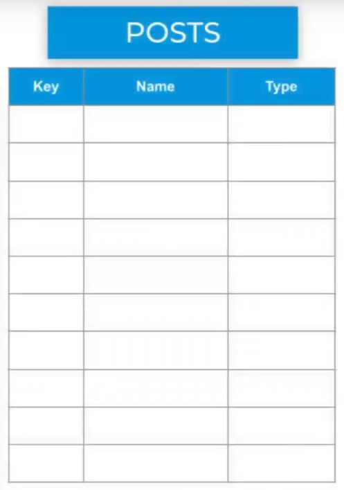
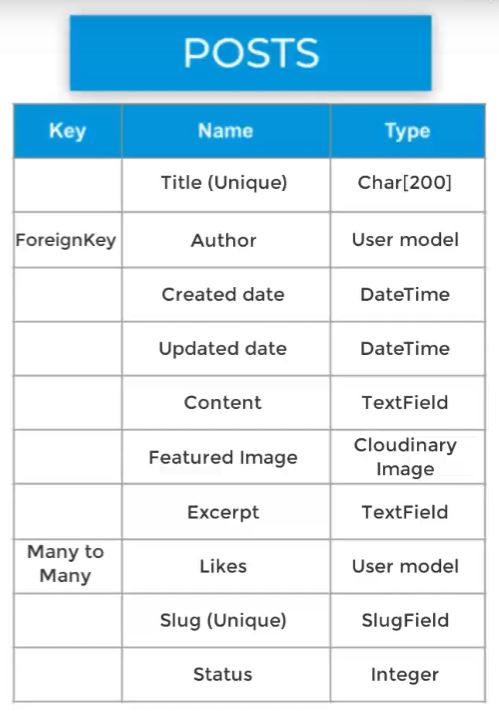
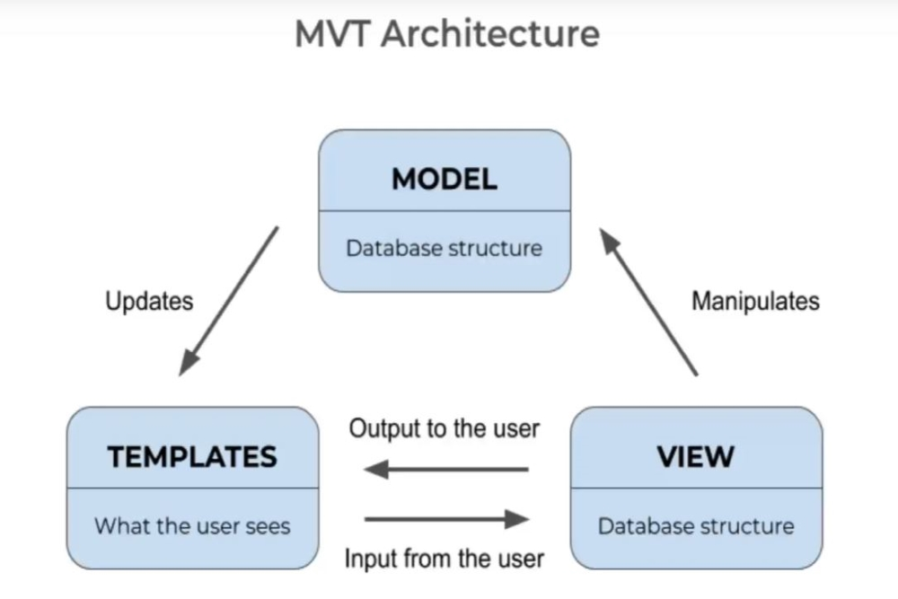
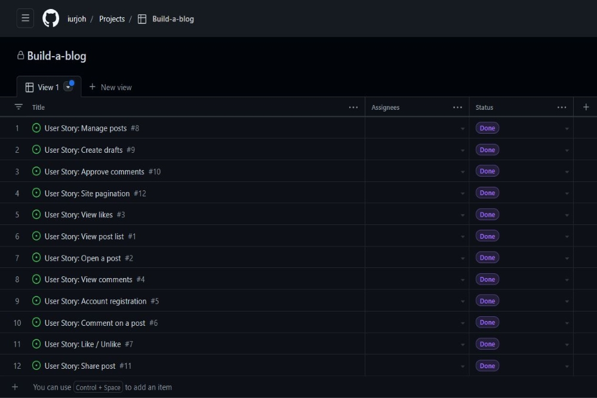
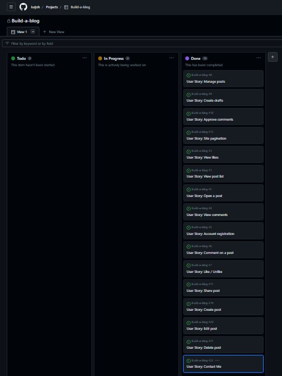

## Arquitetura e ferramentas

```text
Navegador -> URLs e views Django -> templates HTML/Bootstrap
                               -> modelos e banco via DATABASE_URL
                               -> mídia Cloudinary
```

**Linguagens:** Python, HTML5 e CSS3, com algumas linhas de JavaScript.

**Bibliotecas e serviços registrados:** Django, Cloudinary, Allauth, Bootstrap, Django Bootstrap Icons, Crispy Forms, Social Share, Summernote, Gunicorn, OAuthlib, psycopg2, ElephantSQL e Heroku.

`requirements.txt` atual registra Django 3.2.17 e django-allauth 0.52.0, entre outras dependências antigas. O backend usa `SECRET_KEY` e `DATABASE_URL` do ambiente, com `DEBUG = False`. A presença dessas configurações não garante que o app esteja seguro; permissões das views precisam de revisão própria.

## Design e funcionalidades

O layout usa cabeçalho, menu, grade de publicações e páginas de detalhe, formulários e rodapé. Os screenshots abaixo são os existentes no projeto original, não snapshots novos de um deploy atual.

### Cadastro, login e logout

Allauth foi usado para cadastro e gerenciamento de contas. O registro original apresenta autenticação como base para interação e administração. A autorização de edição/exclusão declarada no texto não é garantida pelas views atuais.

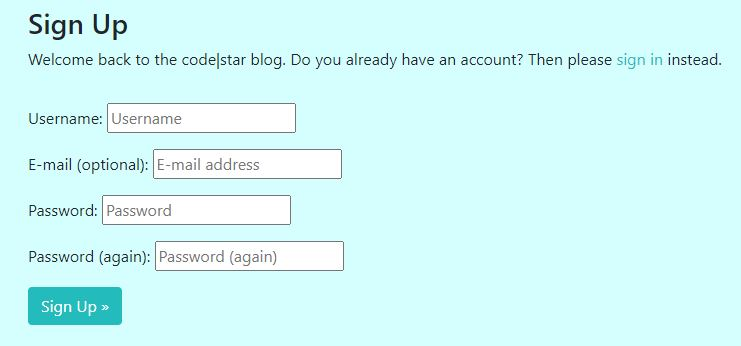
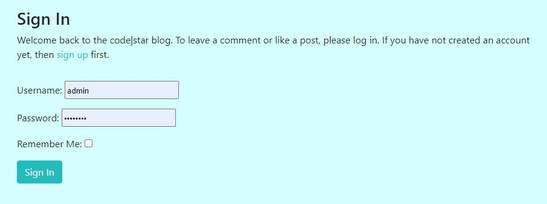
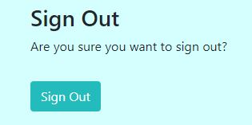

### Cabeçalho e menu

O cabeçalho apresenta o nome do blog, acesso à página inicial e login/logout, além de uma descrição. Em telas pequenas, um botão abre as opções de navegação.

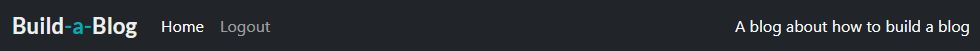
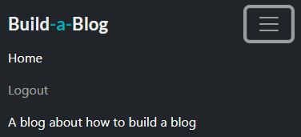

### Mensagens

Avisos aparecem após cadastro, login, logout e envio de comentários.

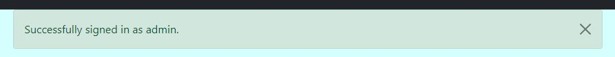
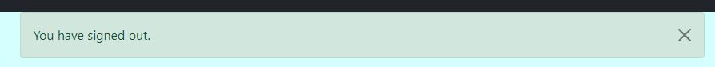
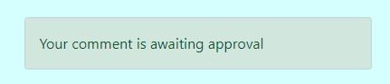

### Lista de publicações

A grade original mostra até seis publicações em telas maiores e uma coluna em telas pequenas. `PostList` usa paginação de seis itens.

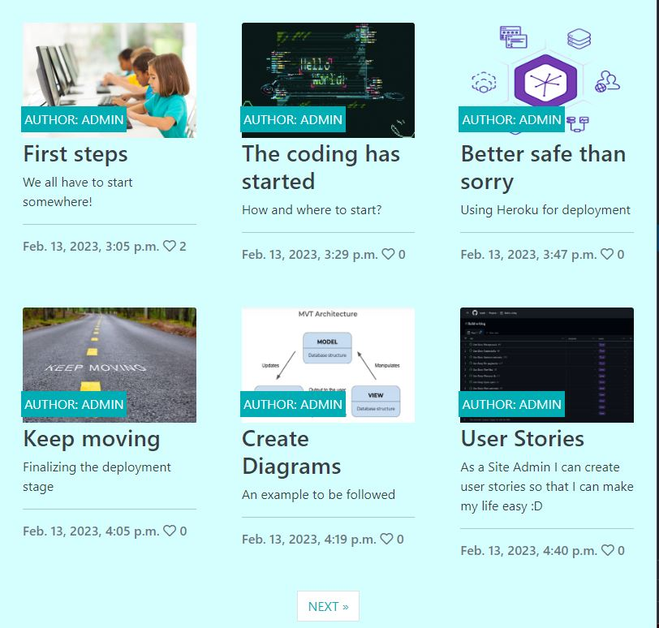

### Compartilhamento

O registro original inclui botões para Twitter, WhatsApp, Telegram e Reddit, com ícones e cores para identificação. O comportamento atual dessas plataformas e links não foi testado nesta revisão.


### Rodapé

Informações do desenvolvedor e links sociais.


### Administração

O painel Django reúne usuários, grupos, comentários, publicações e outros registros. O projeto adicionou recursos de bibliotecas e filtros de autor, data e aprovação.

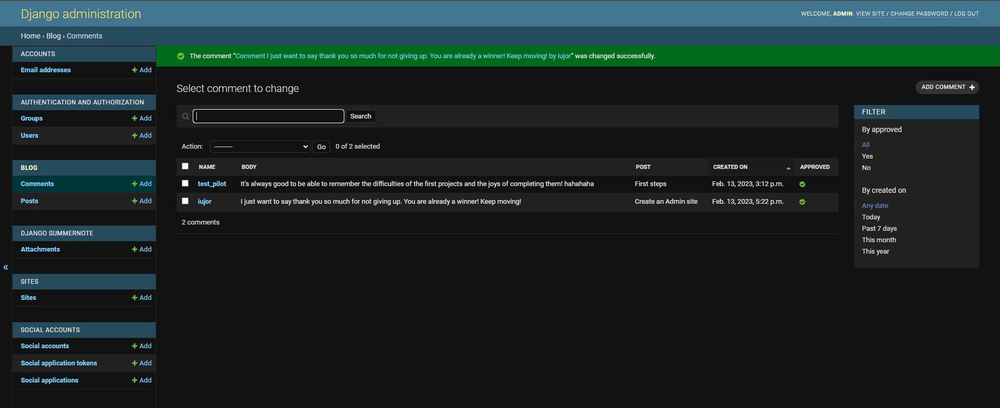

### Detalhe da publicação

Título, autor, data, conteúdo, contadores, compartilhamento e área de comentários.

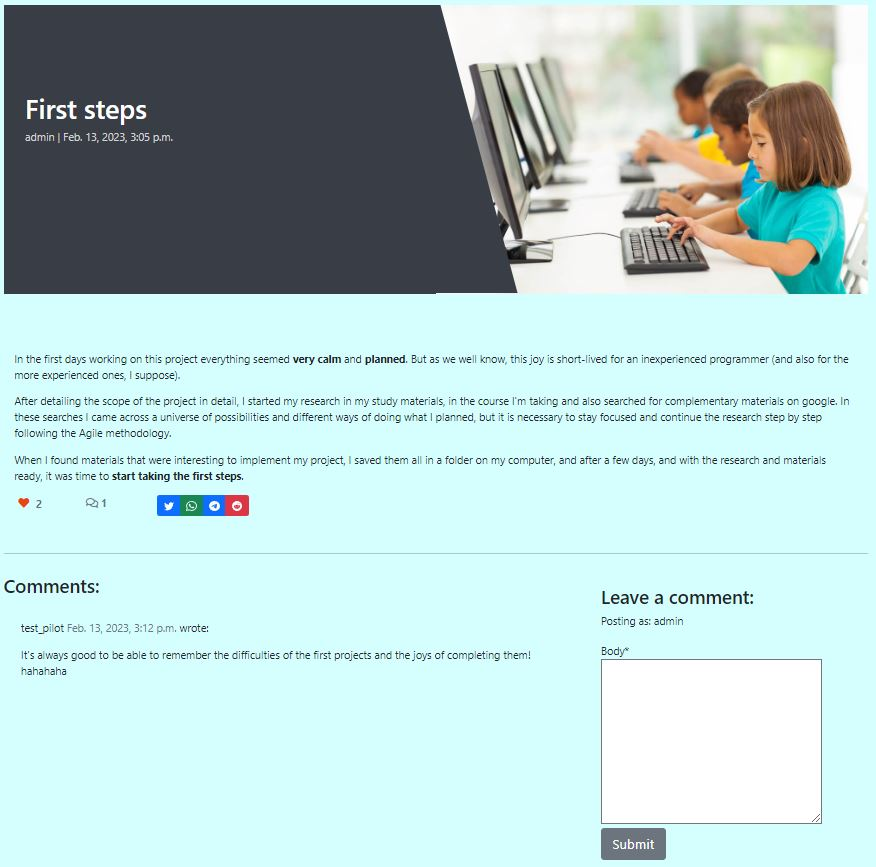

### Curtidas

O registro original descreve um botão de coração que alterna entre curtir e remover curtida, acompanhado de contador.

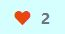

### Comentários

Há contador, campo de texto e envio para moderação. A view exibe comentários aprovados, conforme o código atual.


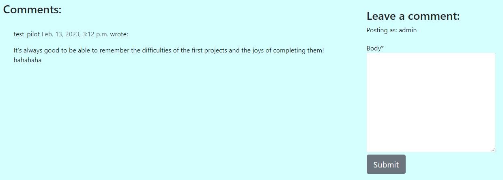
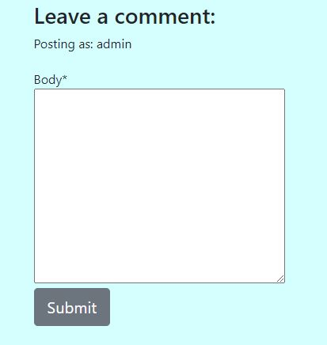

### Criar publicação

O menu abre formulário de título, imagem, resumo e conteúdo. `PostCreate` define a publicação como publicada e vincula o autor à requisição. Essa observação não substitui testes de autenticação e validação.


### Editar publicação

O planejamento previa edição pelo dono, com título, imagem, resumo e conteúdo. O botão azul abre o formulário. **O código atual da view não verifica autoria; essa restrição precisa ser implementada no servidor.**


### Excluir publicação

O planejamento previa exclusão pelo dono com confirmação. **A view atual de exclusão não verifica autoria ou login no servidor.** O diálogo de confirmação não corrige esse limite.


### Contato

O botão "Contact Me" abre formulário de email, assunto e mensagem. A view atual salva um registro `Contact`; o comentário sobre envio de email no código não é uma implementação de entrega, portanto esta documentação não promete que um email seja enviado.


## Próximas funcionalidades

Propostas do registro original, não verificadas como implementadas:

- Login por provedores como Google, Outlook e GitHub.
- Comentários com GIFs, imagens e outros recursos de interação.
- Perfil do autor com foto e descrição.

## Bugs e testes históricos

### Bugs registrados

O autor descreve erros de digitação e de uso das bibliotecas, corrigidos com documentação, tutores, Slack e fóruns. Um conflito de JavaScript do Bootstrap com logout foi investigado; o atributo associado ao comportamento foi removido no registro original. Essa explicação histórica não prova ausência atual de bugs.

O registro de testes também relata problemas em celular ao reduzir e aumentar zoom:

- Ícones de curtidas e comentários muito próximos ou sobrepostos.
- Botões de compartilhamento desaparecendo.
- Imagem visível na capa, mas ausente no detalhe em telas pequenas.

A simulação desktop no inspetor não reproduziu os mesmos efeitos. Esses itens devem ser verificados novamente em aparelhos reais.

### Ferramentas utilizadas no histórico

- JSFiddle para o JavaScript.
- Extends Class para sintaxe Python.
- pycodestyle 2.9.1 para estilo Python.
- Flake8, com observações de código não usado e linhas longas.
- CI Python Linter para PEP8.
- Testes no próprio celular.

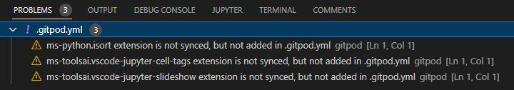
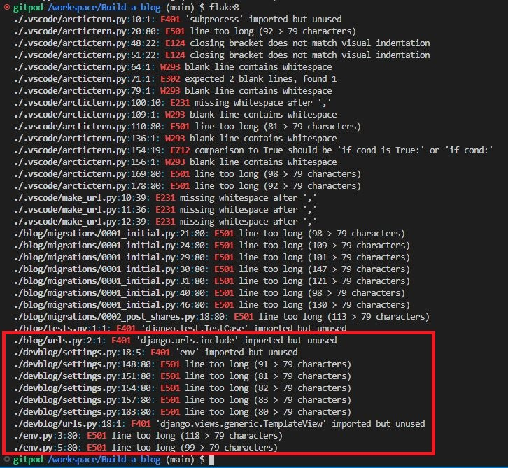
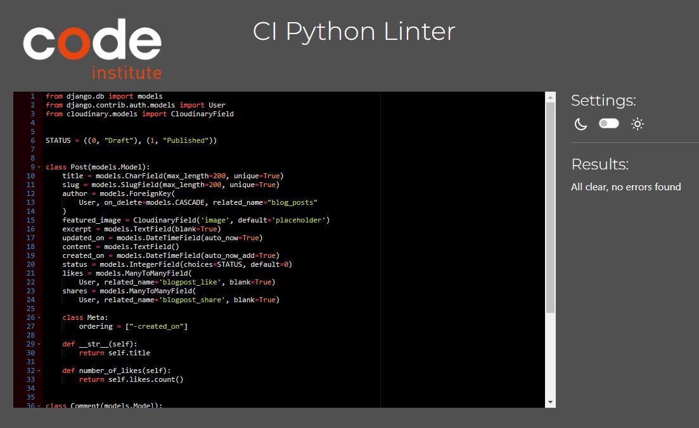
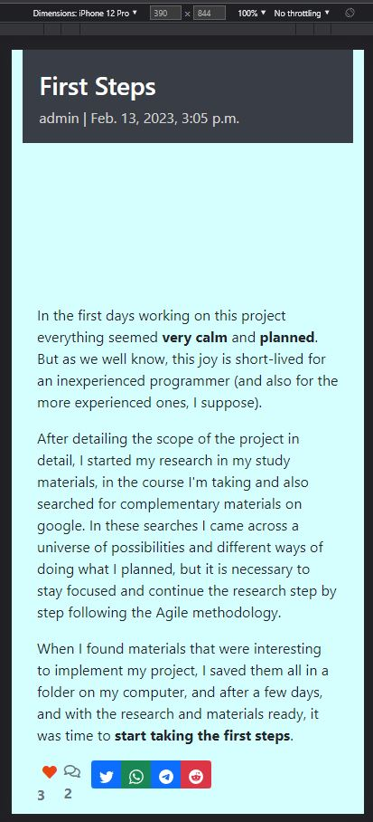

Nenhum desses resultados foi atualizado em 01/10/2026. Antes de reutilizar, teste acesso anônimo, edição/exclusão por não donos, criação de conteúdo, moderação, validação de formulários, mídia e dependências.

## Desenvolvimento local e deploy

Use ambiente isolado, credenciais de teste e banco separado. A sequência abaixo é preparação baseada na estrutura, não uma execução validada nesta revisão:

```bash
python3 -m venv .venv
source .venv/bin/activate
pip install -r requirements.txt
```

Configure `SECRET_KEY` e `DATABASE_URL` locais conforme `devblog/settings.py`; o banco SQLite do template está comentado. Reveja a configuração de mídia se for testar uploads. Não publique `env.py` nem credenciais.

```bash
python3 manage.py migrate
python3 manage.py runserver
```

O registro original descreve fork/clone, criação de app Heroku, conexão ao GitHub e deploy. Esses são passos históricos. O custo, os planos, as dependências e a disponibilidade atual precisam de revisão antes de escolher hospedagem.

O texto original confundia a URL do repositório com deploy GitHub Pages. GitHub Pages não executa este backend Django; https://github.com/iurjoh/Build-a-blog/ é o código-fonte.

Novos snapshots devem ficar em `docs/assets/`, com data e dados fictícios. Os screenshots históricos permanecem em `media/` para preservar o registro.

## Créditos e licença

Baseado no template e no curso Full Stack da Code Institute. Nenhum `LICENSE` foi encontrado na raiz durante a revisão; esta atualização não aplica MIT ao código de terceiros.

### Conteúdo e ferramentas citados originalmente

- [Stack Overflow](https://stackoverflow.com/), [Code Institute](https://learn.codeinstitute.net/), [GitHub](https://github.com/), [Google](https://www.google.com) e [YouTube](https://www.youtube.com/): pesquisa e aprendizado.
- [Pycodestyle](https://pypi.org/project/pycodestyle/), [Flake8](https://flake8.pycqa.org/en/latest/), [CI Python Linter](https://pep8ci.herokuapp.com/#), [Extends Class](https://extendsclass.com/python-tester.html) e [JSFiddle](https://jsfiddle.net/): validação de código.
- [Slack](https://slack.com/): comunidades de suporte.
- [Django](https://docs.djangoproject.com/en/4.1/), [Django Social Share](https://pypi.org/project/django-social-share/) e [Django Allauth](https://django-allauth.readthedocs.io/en/latest/): documentação.
- [Django Bootstrap Icons](https://pypi.org/project/django-bootstrap-icons/), [Font Awesome](https://fontawesome.com/icons), [Bootstrap Icons](https://icons.getbootstrap.com/) e [Bootstrap](https://getbootstrap.com/docs/4.0/getting-started/introduction/): interface.
- [Color Hunt](https://colorhunt.co/palettes/): referência de cores.
- [Techsini](https://techsini.com/multi-mockup/index.php): montagem da imagem em vários dispositivos.
- Ao mentor, pelo feedback durante o desenvolvimento.

Esses links preservam os créditos históricos, sem afirmar que todos foram verificados agora.
